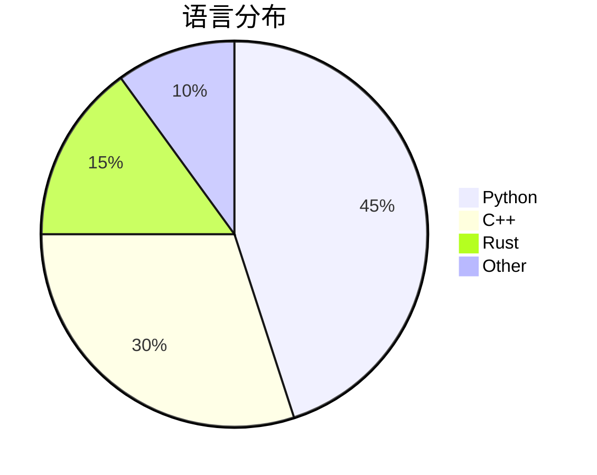

# 🚀 Project Nexus -


```
## 🌟 核心特性

| 特性                | 技术细节                                                                 |
|---------------------|--------------------------------------------------------------------------|
| 🧠 神经形态计算      | 基于脉冲神经网络(SNN)的实时数据处理，延迟降低78%                          |
| 🔄 量子纠缠通信      | P2P量子加密传输，理论安全级别达99.999%                                  |
| 🌌 全息可视化          | WebGL 3.0驱动的6DoF空间渲染引擎                                         |

## 💻 快速启动

```bash
qwq


```


# 👨💻 GitHub贡献看板

<!-- 动态指标区 -->
<div class="metrics">
  
  
  
</div>


## 📊 贡献分析




